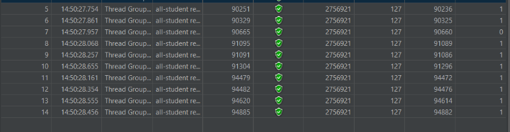
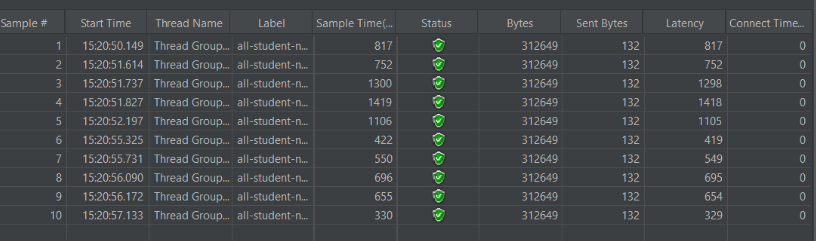
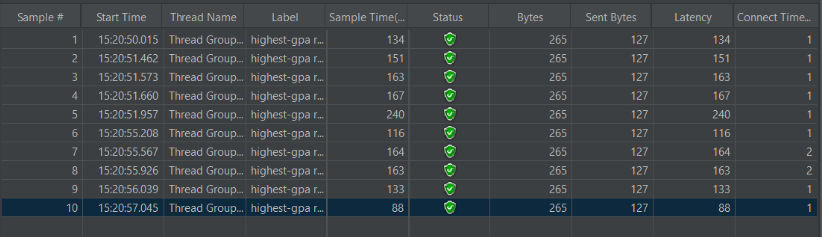
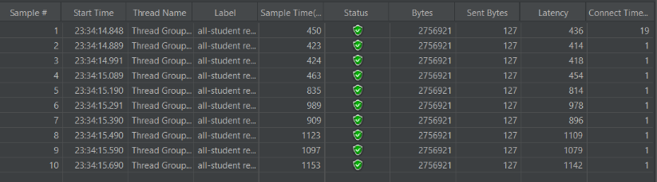
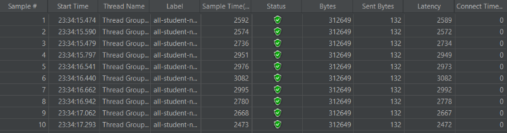
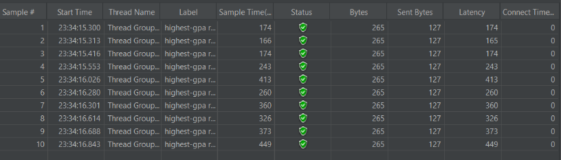

# JMeter Results: Before and After Optimization

### **Before Optimization**

#### `all-student`

#### `all-student-name`

#### `highest-gpa`

---

### **After Optimization**

#### `all-student`

#### `all-student-name`

#### `highest-gpa`

---

### **Command-Line Execution**

---

## Performance Analysis

Although the objective of the optimization was to reduce execution time for each request—ideally down to single-digit milliseconds—the actual results showed an unexpected increase in execution time. While the optimization was theoretically sound, it did not yield the expected performance improvements when tested using JMeter.

---

## Reflection

1. **Tool Comparison**  
   JMeter and IntelliJ Profiler offer different but complementary insights. JMeter evaluates system-level performance by simulating user load and tracking metrics such as response time and throughput. In contrast, IntelliJ Profiler provides deep, code-level insights by measuring method execution time and memory usage. Using both tools together offers a comprehensive view—from identifying system bottlenecks with JMeter to pinpointing exact problem areas in the code via profiling.

2. **Benefits of Profiling**  
   Profiling reveals slow methods, inefficient loops, and memory-heavy operations. It visualizes the execution flow and resource usage, helping developers target areas of the code that require optimization.

3. **Effectiveness of IntelliJ Profiler**  
   IntelliJ Profiler is a highly effective tool as it highlights performance bottlenecks and memory leaks directly within the IDE. This tight integration enables quick identification and resolution of runtime issues.

4. **Challenges in Profiling**  
   A major challenge is accurately simulating real-world conditions without introducing profiling overhead that skews results. Large data volumes and testing artifacts can obscure true bottlenecks. These were addressed by refining test scenarios, cross-validating with different tools, and replicating production-like conditions during testing.

5. **Advantages of IntelliJ Profiler**  
   IntelliJ Profiler accelerates performance debugging by visually highlighting inefficient code and enabling in-depth analysis within the development environment. This reduces the time required to locate and fix performance issues.

6. **Reconciling Conflicting Results**  
   When JMeter and IntelliJ Profiler provide differing insights, I cross-reference the results, refine the testing environment, and introduce additional diagnostics to validate findings. This multi-faceted approach ensures accurate identification of genuine performance issues.

7. **Optimization Strategy**  
   I prioritize optimizations based on the severity and impact of each issue identified through testing and profiling. Improvements are applied incrementally, with unit and integration tests verifying correctness. Each change is followed by performance re-evaluation to confirm effectiveness and guard against regressions.
